# Architecture Diagrams
## Notion Task Tracker CLI

Visual representations of system architecture, data flows, and component interactions.

---

## System Architecture Overview

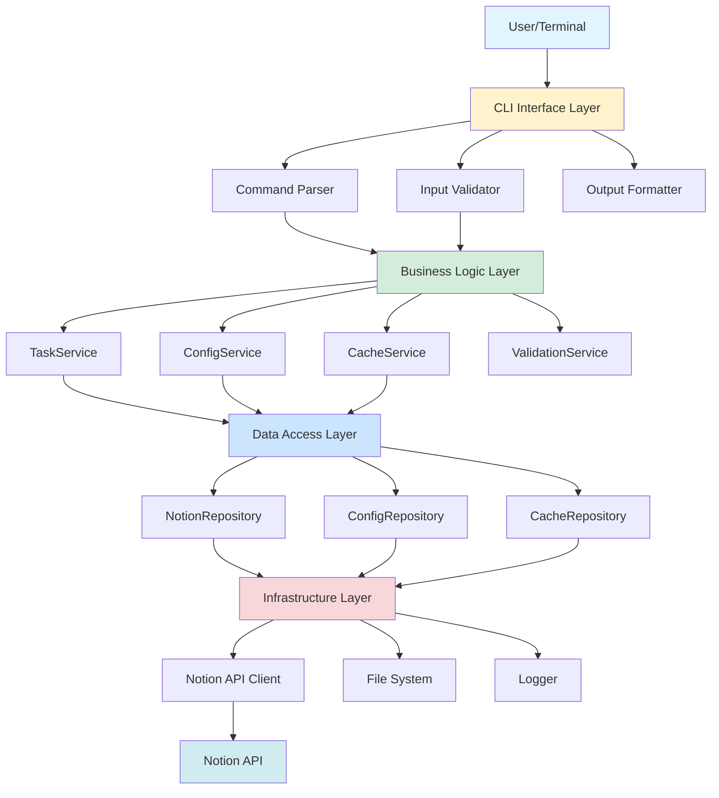

---

## Component Interaction - Task Creation Flow

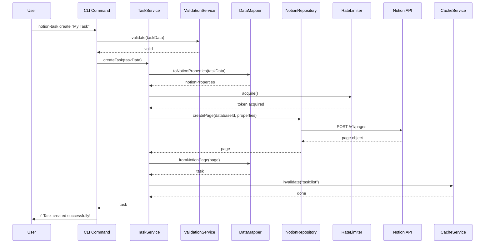

---

## Data Flow - Query with Caching

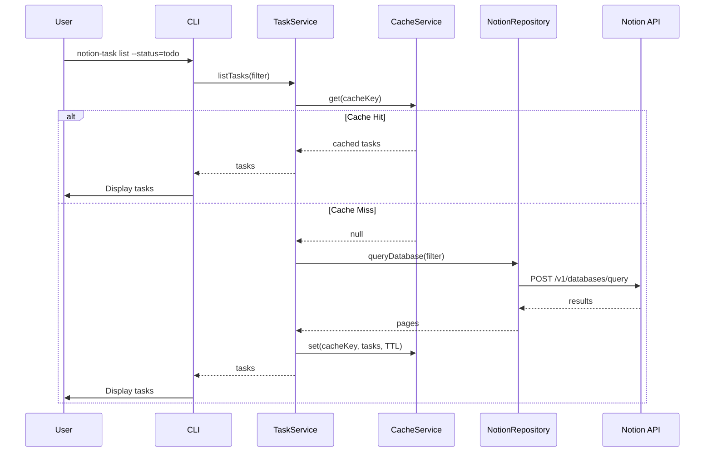

---

## Error Handling Flow

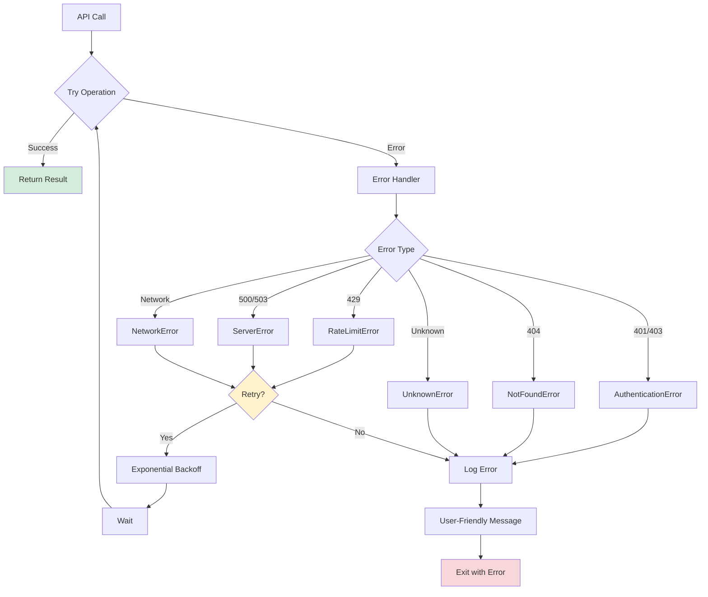

---

## Rate Limiting - Token Bucket

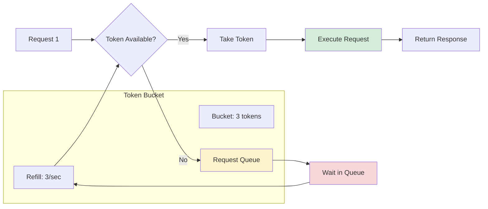

---

## Configuration & Security

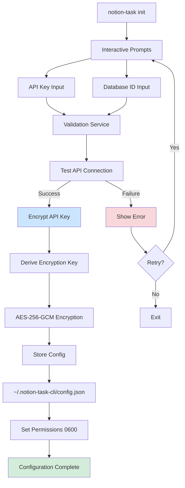

---

## Deployment Architecture

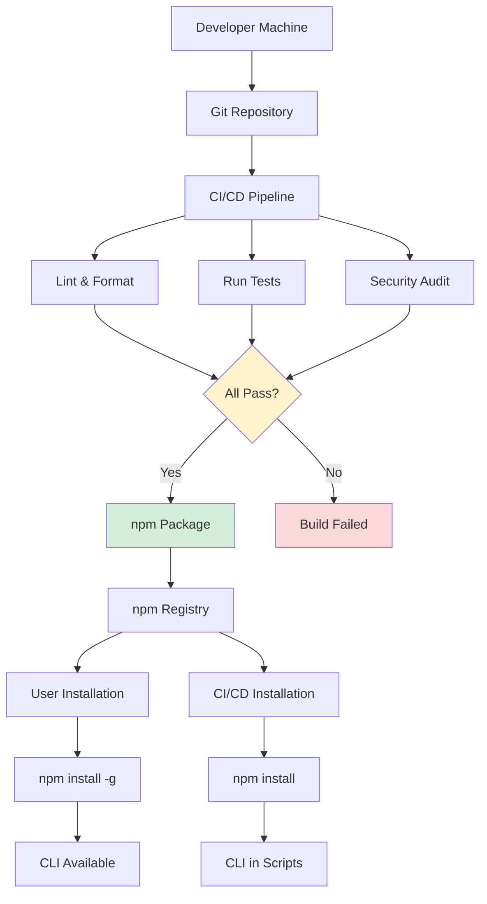

---

## Class Diagram - Core Components

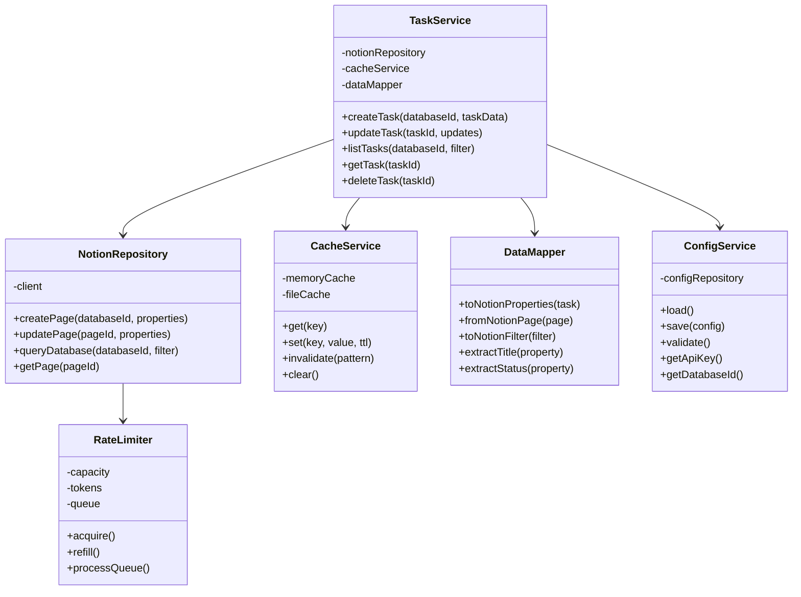

---

## State Machine - Task Lifecycle

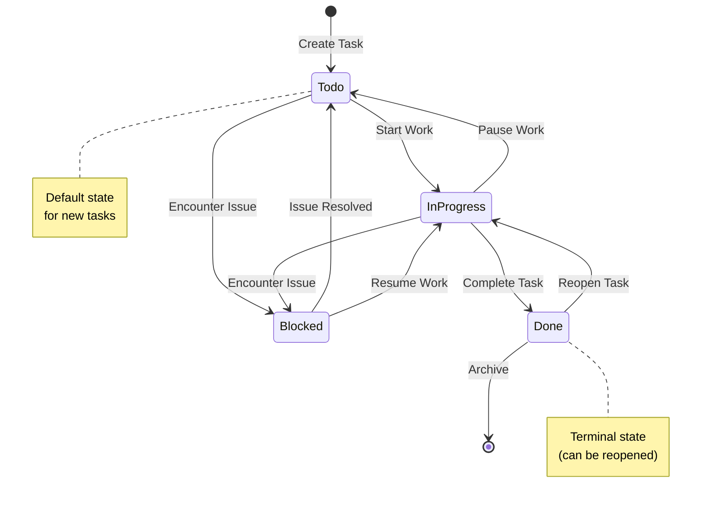

---

## Caching Strategy

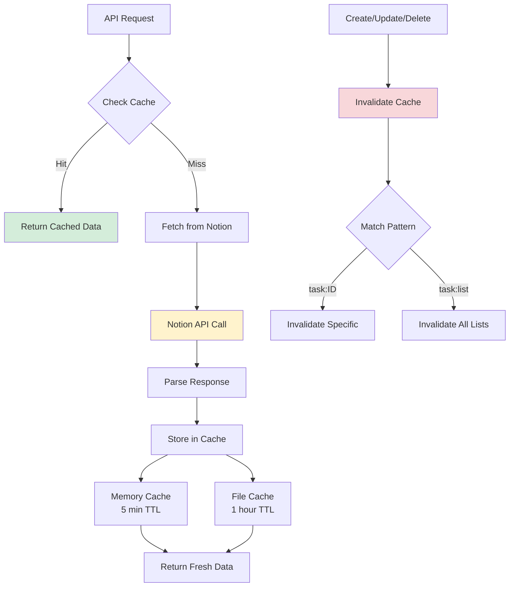

---

## Security Layers

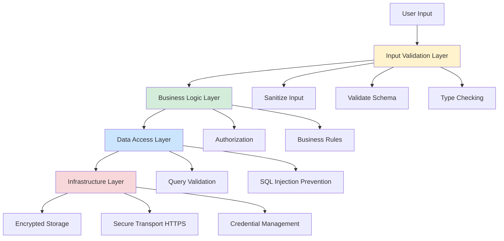

---

## Performance Optimization Points

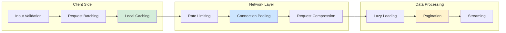

---

## Testing Pyramid

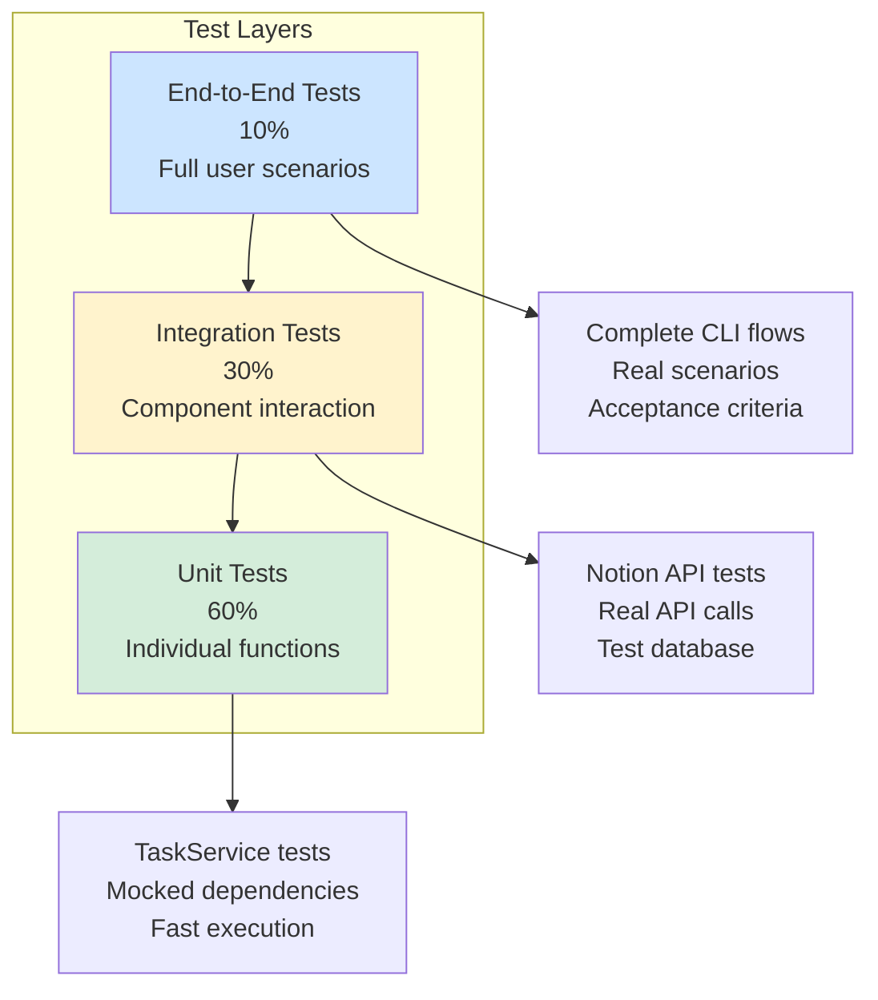

---

## Retry Strategy Flow

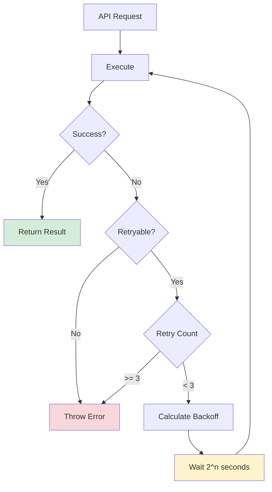

---

## Offline Support Architecture

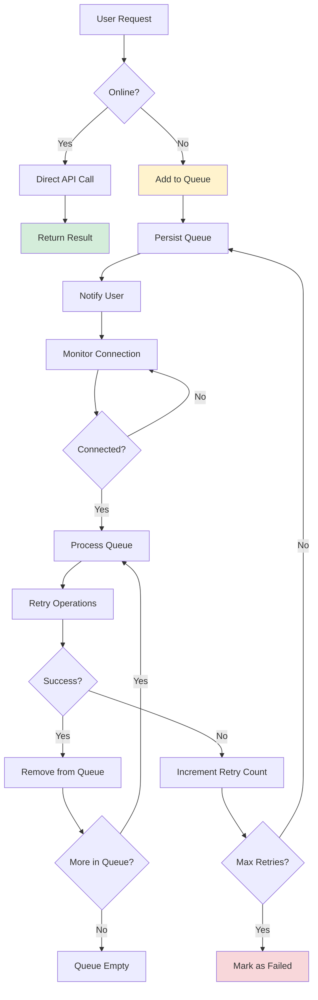

---

## Legend

### Colors
- 🟢 Green: Success states, completed operations
- 🟡 Yellow: Waiting states, in-progress operations
- 🔵 Blue: Information, data storage
- 🔴 Red: Error states, security layers

### Shapes
- Rectangle: Process/Action
- Diamond: Decision point
- Rounded Rectangle: Start/End state
- Cylinder: Data storage

---

*These diagrams are maintained alongside the architecture documentation and should be updated when system changes occur.*

*Last Updated: March 10, 2026*
